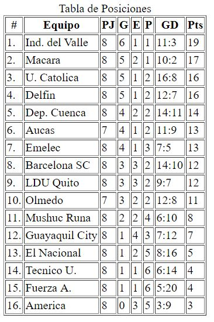
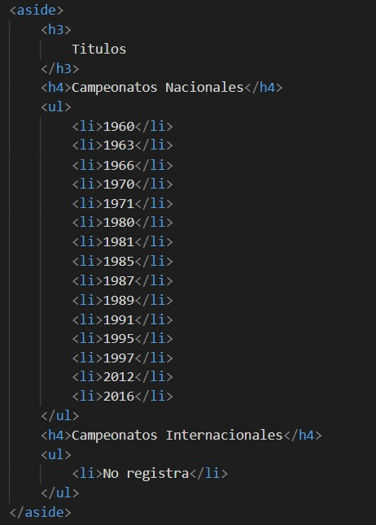
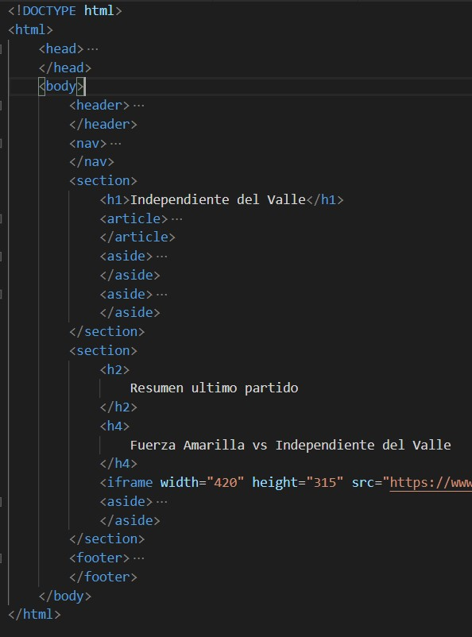

## Estructurar un sitio web estático usando HTML5. El sitio web será informativo sobre un tema que será autoría del estudiante. El sitio web deberá contar con una página principal denominada index.html y debe contener al menos cinco páginas *.html más. Todas las páginas contaran con un menú de navegación que permitirá al usuario moverse entre todas las páginas HTML.
Para el desarrollo de esta practica se eligió el tema del campeonato nacional de futbol, donde tenemos 6 paginas, la de inicio que contiene información de la Liga Pro y noticias, y otras 5 paginas que hablan sobre los 5 principales equipos de esta competición, a continuación se muestra el archivo con los html de cada pagina y tanto el código como la ejecución de la una de las paginas para evidenciar el menú de navegación.

Para el menú de navegación se utilizó una lista desordenada ul  con enlaces a en los elementos de listas li. 

## Todas las páginas *.html deben estar estructuradas según el siguiente formato:

## En donde, la etiqueta header deberá contener una imagen (logo) relacionada al tema elegido.
En la etiqueta header se coloco el logo de la Liga Pro, esta imagen esta almecenada en la carpeta imagenes por lo que se tuvo que usar una ruta relativa y se coloco una alternativa que mostrara un texto descriptivo de la imagen por si esta no llega a cargarse. 
Adicionalmente a esta imagen se le coloco un vinculo para que nos lleve a la pagina de inicio.

## Además, la etiqueta footer deberá tener la información del estudiante como nombres completos, organización, correo (usar hipervínculo, mailto), teléfono (usar hipervínculo, tel), además deberá tener el símbolo de copyright junto a la leyenda de “Todos los derechos reservados”. Por ejemplo, © Todos los derechos reservados
Para la etiqueta de footer o pie de pagina se agregaron párrafos con la información personal como nombre, institución, mail, teléfono y una que tenga el texto “Todos los derechos reservados”.
Para el mail se le agrego un vinculo con mailto: para que nos rediriga automáticamente a nuestra aplicación de correo, lo mismo para el teléfono con la opción tel:.
En el párrafo de Todos los derechos reservados anadimos el comando &#169; para que nos incluya el símbolo de copyright.

## Las páginas html deberán tener al menos una etiqueta section, article y aside.
Con estas etiquetas obtenemos tener la información de la pagina divida por secciones, en este caso las etiquetas article y aside forman parte de section. Con esto obtenemos la mejor distribución para la información de nuestra pagina.
 
 
 ## De igual manera, se pide que al menos una de las páginas dentro del contenido de la etiqueta article, tengan los siguientes requisitos:
## -Una tabla con la siguiente estructura:
Para esta pagina, se creo una tabla de posciones del campeonato ecuatoriano.
Se uso la etiqueta table que nos facilita la creación de la tabla.
Para los títulos de las columnas se uso la etiqueta th que se usa para el encabezado de una columna.
Para crear filas se utilizo la etiqueta tr y para las columnas que tendrán la información se utilizo la etiqueta td

## -Un video de YouTube (ver, etiqueta iframe).
La etiqueta iframe sirve para anclar a nuestra pagina un video, pagina web, archivo, etc. a nuestra pagina.
Para este caso se anclo un video de youtube, debemos pasarle el parámetro src (source) en el que especificaremos el link del video de la siguiente manera https://www.youtube.com/embed/(identificador del video). Y también le pasamos 2 parametros adicionales para ajustar el tamaño de la ventana del video.

## -Manejar listas ordenadas o desordenadas con al menos cinco ítems. 
Para este caso, al igual que el la etiqueta de navegación se creo una lista desordenada con la etiqueta ul y cada elemento de la lista con la etiqueta li.

## -Tener al menos cinco etiquetas de texto que se encuentran en la figura 1- 16 del texto guía de la asignatura.
A lo largo de toda las paginas web se incluyeron estas etiquetas de texto, que básicamente nos ayudan para poder darle algún estilo ya sea por diseño o para dar enfesis a una parte del texto o a todo el texto.
En esta imagen se usaron las etiquetas strong que pone en negrita el texto, la etiqueta em que indica énfasis y la etiqueta cite que sirve para citar y pone el texto en cursiva.

## Asimismo, se pide que todos los artículos tengan al menos una imagen cada uno. Se pide que todas las imágenes están almacenadas en una carpeta llamada “imágenes”. Por lo tanto, se debe trabajar con rutas relativas.
En las imágenes podemos observar la carpeta “imagenes” que contiene todas las imágenes usadas para la creación de estas paginas.

Para insertar una imagen en la pagina html se utiliza la etiqueta img que tiene los parametos src en donde especificamos la ruta relativa de la imagen, el parametro alt que nos mostrara un texto si es que la imagen no llega a cargarse, y los parametros width y height para darle un tamano a las imágenes.

## Finalmente, se pide que una de las páginas tenga al menos dos secciones (section) con tres artículos (article) cada sección. Luego, cada sección debe tener un encabezado (header), en donde, se ubicaran enlaces que permitan navegar entre los artículos usando id’s (ver, página 63 del texto guía).
En esta imagen se muestra una de las secciones, con un header y 3 articles.
En la sección header se encuentran los vínculos a los diferentes artículos.
Y cada article podemos observar que tiene un id, el mismo que debemos colocar en los vínculos del header para que nos lleve hasta esa sección de la pagina.

## La evidencia de la correcta estructuración de las páginas HTML. Para lo cuál, se puede generar fotografías instantáneas (pantallazos).
## Pagina index

## Pagina Dep Cuenca

## Pagina Barcelona

## Pagina Emelec

## Pagina LDU Quito

## Pagina Ind Valle

## La evidencia de la validación de cada página HTML.
## Pagina index.

## Pagina Deportivo Cuenca

## Pagina Barcelona

## Pagina Emelec

## Pagina LDU Quito

## Pagina Ind Valle

## Conclusiones
- Se logro dividir en varias secciones la información de la pagina, esto nos sirve para tener una mejor estructura de nuestra pagina
- Es importante validar nuestras paginas antes de exponerlas para su uso, ya que pueden presentar cualquier tipo de fallo en su ejecución.
- Html nos sirve exclusivamente para seccionar la pagina, si queremos aplicar diseños y organizar mejor la pagina debemos usar CSS.
- No existen limitantes para la creación de una pagina, ya que HTML5 a evolucionado bastante y se puede decir que tenemos etiquetas para implementar todo lo que queramos.
- Se debe realizar varios commit en nuestro proyectos, esto nos ayudara para el manejo de errores y versiones.
## Recomendaciones
- Es muy importante mantener el orden (tabulaciones y cerrado de etiquetas) ya que nos podemos perder fácilmente escribiendo el código.
- Una vez verificada la estructura de nuestra pagina se debe incorporar CSS para tener un producto amigable para el usuario final.
## Información de GitHub de este proyecto
## -	Usuario: 
damoralesr97
## -	URL del repositorio: 
https://github.com/damoralesr97/Practica01-Mi-Blog
## Información de GitHub del Tutorial 01 - Curbside Thai
## -	Usuario: 
damoralesr97
## -	URL del repositorio: 
https://github.com/damoralesr97/PH_Tutorial1
